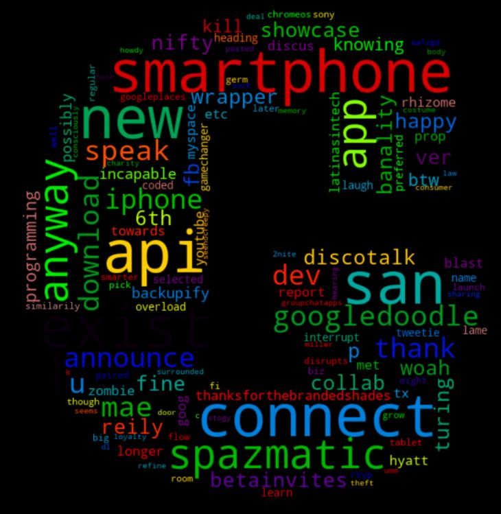

<<<<<<< HEAD
# Twitter Sentment Analysis


**Authors**: Czarina Luna, Marcelo Scatena, Piotr Czolpik, Ross McKim

## Overview

We are digital brand advisors that have been hired by South by Southwest. Our goal in this analysis is to do a proof of concept measure of the effect of the Apple pop up tent on twitter sentiment at the 2011 SXSW festival. In 2011 Apple released the Ipad 2 at the SXSW festival which makes this an ideal situation for analyzing first impressions of a small group of people.

* Atendees of technology festivals usually have a strong social presence
* First impressions of products can influence a great deal in sale numbers
* Sentiment analysis can help companies understand what they're doing right, and what they need to improve
***

## Business Problem

South by Southwest is primarily a film and music event and may not have expertise in analyzing social media postings but this measure of sentiment could help determine how much the event charges for booths, advertisements, and other commercial exposures. We are examining how effectively we can measure sentiment during such an event.
To accomplish this task we used a Machine Learning model that uses Natural Language Processing and distinguishes between positive, negative, or neutral sentiment in a tweet. The focus though is on being able to classify the highest amount of Negative sentiments, since they are the ones that may influence others that are still undecided on purchasing a product.
***

## Data

The information we have is regarding the 2011 South by Southwest festival that introduced the Ipad2. It is in data.world and can be found [here](https://data.world/crowdflower/brands-and-product-emotions). It contains over 9,000 tweets from users talking about the festival and it's products, and the sentiment of the tweet has been categorized by it being either positive, negative, neutral or unable to tell.
There is a big imbalance of results in that regard, and another one when taking into consideration which products those sentiments are regarding.

***

## Methods & Evaluation Metrics
 
 * The dataset contains only three features: one is the text from the tweet, one our target, one a product that the tweet regarded. This is a perfect example of where Natural Language Processing can be used.

 The text data from the tweet are not very easily understandable. A lot of tweets don't follow a proper english phrase sequencing, and they're filled with hashtags, mentions, links, tags, retweets, and other occurances that we had to take into account in our preprocessing. 
 This eare some of the methods we used in the cleaning process:
  - Lower casing
  - Removal of non-ascii characters
  - Removal of urls
  - Removal of tagging
  - Removal of punctuation and special characters
  - Removal of common stopwords
  - Removal of specific stopwords
  - Lemmatization

As far as our evaluation metric goes, we first chose a baseline mode in regards to it's accuracy, then chose first to focus on Precision, since it cares about the number of False Negatives we get. Given this multi classification problem though, we decided that finding out thos tweets with negative sentiment towards your brand is the most important thing, and chose to adopt that as a metric.
***
## Results

* Skyler Graph


* Confusion matrix


explanation of matrix

* Below we can see Word Clouds of the positive and negative sentiments from the whole dataset, and the ones regarding sentiment towards Apple and Google




* Last graph


Explanation of last graph

***

## Conclusions

Given all the information we modeled, the recommendations we have are:

* Reccommendation 1
  - Explain reccommendation 1.
* Reccommmendation 2
  - Explain reccommendation 2.
* Reccommendation 3
  - Explain reccommendation 3
***
## For More Information

Please review our full analysis in [our Jupyter Notebook](./final_notebook.ipynb) or our [presentation](./final_presentation.pdf).

For any additional questions, please contact<br />
**Czarina Luna: aczarinagarcialuna@gmail.com**<br />
**Marcelo Scatena: marcelo.oddo@gmail.com**<br />
**Ross McKim: rmckim@gmail.com**<br />
**Piotr Czolpik: Piotrczo1992@gmail.com**<br />

## Repository Structure

```
├── README.md                           
├── final_notebook.ipynb   
├── final_presentation.pdf         
├── data                                
└── images                              
```
